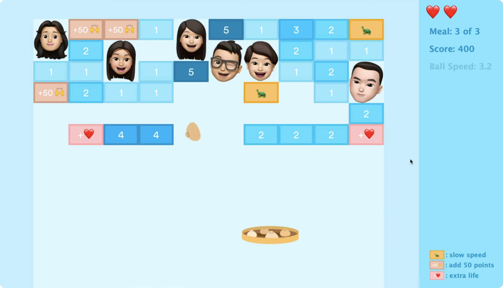

## Overview
Sundays at Dim Sum is a single-player game where players control a platform of food to bounce into my family member's mouths. This theme originated from my love for going to dim sum with my family, which is a meal where we order a variety of small Chinese dishes to all share. 
This game consists of 3-levels of increasing difficulty and contains a series of special blocks (extra score, extra life, slow down) that make the game suspenseful.
  

Watch a demo of [Sundays at Dim Sum](https://www.youtube.com/watch?v=22fNhZOYoHc)!

## How to play
Use the left and right arrows to collid the food item with the blocks. If the food item falls below your platform, you will lose one of three lives. The game ends when a player loses all of their lives or completes all three levels.

Each level contains a series of blocks that prevent the food item from being reached by a family member. These blocks can be broken after a specific number of collisions from the player, vraying from 1 to 5 collisions. Breaking each block increases player score by 10, and earns them special advantages if they land on certain blocks.
* Extra Score: Gives players a 50 point score increase, as opposed to the normal 10 point increase
* Extra Life: Grants players an extra life (maximum of 3 lives), which can be advantageous in keeping them in the game
* Slow Down: Slows down the food item, which gives the player greater preparation time to hit the food item

## Documentation
For a more detailed understanding of the project structure, visit [my documentation](ProjectDocumentation.pdf).
